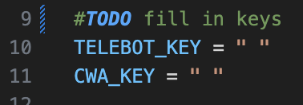

# sitconcamp bot

## installation

1. install packages

```
pip install telebot google.generativeai requests
```

2. fill in your API keys in your file

   
3. run the file

```
python3 main.py
```
